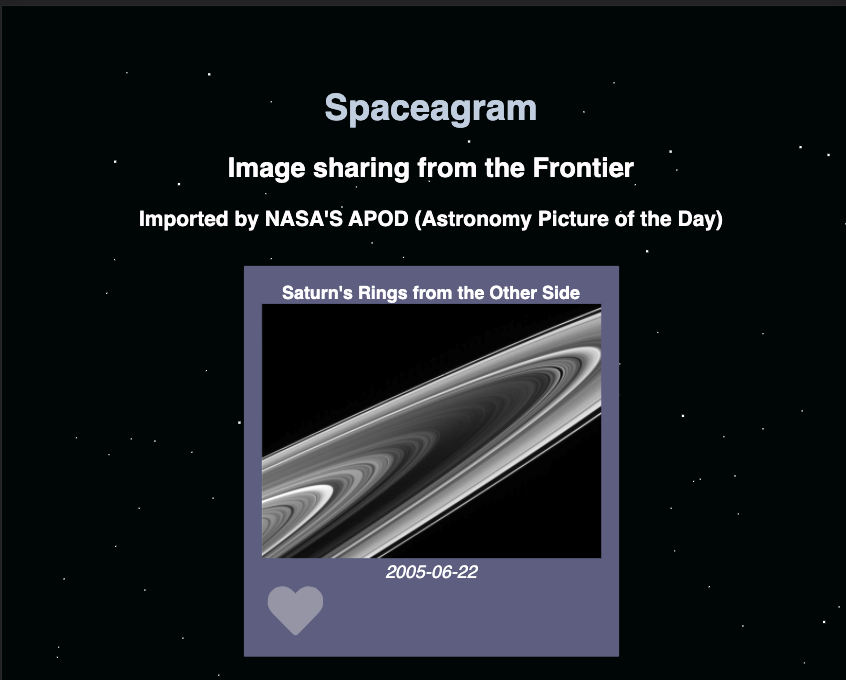

# Spaceagram
> This is a Front End Developer Challenge Winter 2022 for Shopify. 
> Live demo: https://614a8b9f41f2e600ac150006--relaxed-noether-abb911.netlify.app/

## Table of Contents
* [General Info](#general-information)
* [Technologies Used](#technologies-used)
* [Features](#features)
* [Screenshots](#screenshots)
* [Setup](#setup)
* [Usage](#usage)
* [Project Status](#project-status)
* [Room for Improvement](#room-for-improvement)
* [Acknowledgements](#acknowledgements)
* [Contact](#contact)
<!-- * [License](#license) -->

## General Information
- Provide general information about your project here.
- What problem does it (intend to) solve?
- What is the purpose of your project?
- Why did you undertake it?
<!-- You don't have to answer all the questions - just the ones relevant to your project. -->

## Technologies Used
- ReactJs

## Features
List the ready features here:
- There is an animation of the "like" action with the heart icon
- There is a loading state which appeats when we wait for NASA's API to return data
- There is a button to press to load more photos

## Screenshots

<!-- If you have screenshots you'd like to share, include them here. -->

## Setup
What are the project requirements/dependencies? Where are they listed? A requirements.txt or a Pipfile.lock file perhaps? Where is it located?

Proceed to describe how to install / setup one's local environment / get started with the project.

## Project Status
Project is: _in progress_ 

## Room for Improvement
Include areas you believe need improvement / could be improved. Also add TODOs for future development.

Room for improvement:
- Improvement to be done 1
- Improvement to be done 2

To do:
- Feature to be added 1
- Feature to be added 2

## Contact
Created by Isha Kantak - feel free to contact me!

